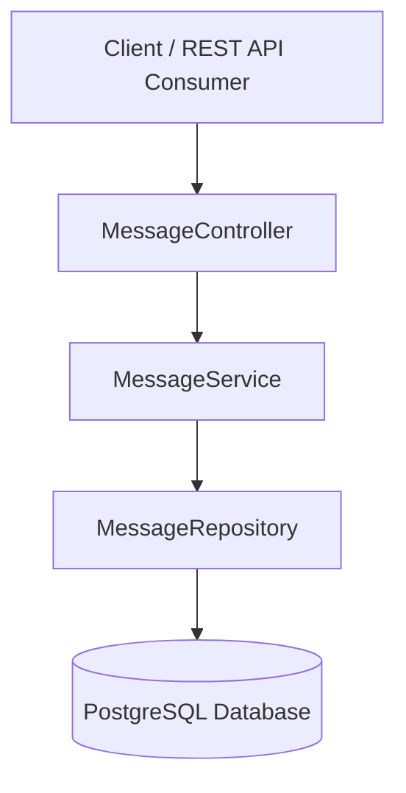

# System Architecture

## 1. Overview

WhisperBox follows a layered architecture, where each layer has a single, well-defined responsibility. This separation improves readability, maintainability, and testability.

The application processes every request through a series of layers before interacting with the database.

---

## 2. Architecture Diagram



---

## 3. Request Lifecycle

A typical request flows through the application in the following order:

1. Client sends an HTTP request.
2. Spring Boot routes the request to the appropriate controller.
3. The controller validates the request.
4. The service executes business rules.
5. The repository performs database operations.
6. PostgreSQL stores or retrieves data.
7. Data is converted into DTOs.
8. A JSON response is returned to the client.

---

## 4. Project Layers

### Controller Layer

Package:

```
com.whisperbox.controller
```

Responsibilities:

- Define REST endpoints.
- Receive HTTP requests.
- Validate request bodies.
- Call the service layer.
- Return JSON responses.

The controller does not contain business logic.

---

### Service Layer

Package:

```
com.whisperbox.service
```

Responsibilities:

- Execute business logic.
- Validate users.
- Create messages.
- Fetch conversations.
- Handle read-once behavior.
- Mark messages as read.
- Coordinate multiple repository operations.

The service acts as the application's business layer.

---

### Repository Layer

Package:

```
com.whisperbox.repository
```

Responsibilities:

- Communicate with PostgreSQL.
- Execute CRUD operations.
- Execute custom queries.
- Return entities to the service layer.

WhisperBox uses Spring Data JDBC instead of manually writing SQL for common operations.

---

### Database Layer

Database:

```
PostgreSQL (Neon)
```

Responsibilities:

- Persist messages.
- Store timestamps.
- Store read status.
- Store expiration information.

Flyway manages all schema changes.

---

## 5. DTO Layer

Package:

```
com.whisperbox.dto
```

DTOs separate the REST API from the database model.

Current DTOs include:

- SendMessageRequest
- MessageResponse
- ApiResponse

Using DTOs prevents exposing internal entities directly through the API.

---

## 6. Entity Layer

Package:

```
com.whisperbox.entity
```

Entities represent database tables.

The primary entity is:

```
Message
```

Each Message object maps to one row in the PostgreSQL database.

---

## 7. Configuration Layer

Package:

```
com.whisperbox.config
```

Responsibilities:

- Read values from application.properties.
- Map logical user names.
- Validate configured users.
- Centralize application configuration.

---

## 8. Exception Handling

Package:

```
com.whisperbox.exception
```

Responsibilities:

- Handle invalid users.
- Handle validation failures.
- Return consistent JSON error responses.

Global exception handling ensures controllers remain clean and focused.

---

## 9. Scheduler

The application contains scheduled tasks that periodically remove expired messages.

Responsibilities:

- Run automatically.
- Delete expired records.
- Prevent database growth.
- Keep application data clean.

---

## 10. Benefits of the Architecture

This architecture provides several advantages:

- Separation of concerns
- Easier maintenance
- Better testability
- Clear responsibilities
- Scalability
- Production-ready structure
- Easy onboarding for new developers
