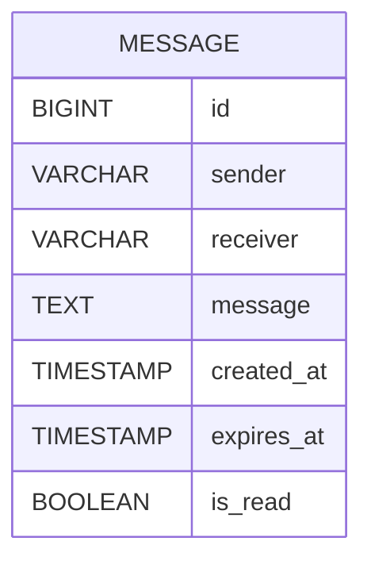

# Database Design

## Database

WhisperBox uses PostgreSQL hosted on Neon.

Database schema changes are managed using Flyway.

---

# Message Table

The application stores all messages inside a single table.

| Column | Description |
|---------|-------------|
| id | Primary Key |
| sender | Sender identifier |
| receiver | Receiver identifier |
| message | Message content |
| created_at | Creation timestamp |
| expires_at | Expiration timestamp |
| is_read | Read-once flag |

---

# Entity Relationship



---

# Read Once Flow

Initially

```
is_read = false
```

When inbox API is called

```
is_read = true
```

Future inbox requests ignore that message.

---

# Expiration Flow

When a message is created

```
created_at = NOW()

expires_at = NOW() + 30 days
```

The scheduled cleanup job periodically deletes expired rows.

---

# Flyway

Flyway manages all schema versions.

Current migrations include:

- Create Message table
- Add expiration timestamp
- Add read status

Future schema changes should always be introduced through new Flyway migration files.

---

# Why PostgreSQL?

- Reliable
- ACID compliant
- Excellent Spring Boot support
- Strong indexing capabilities
- Easy cloud hosting
